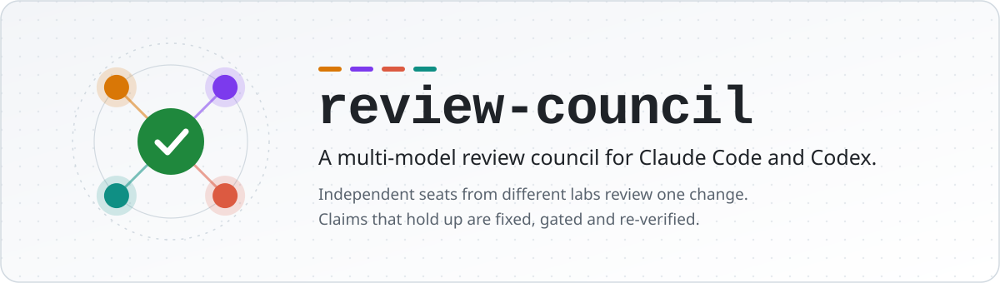
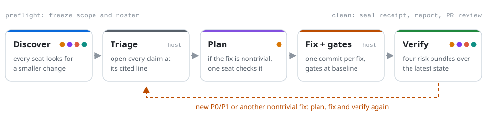
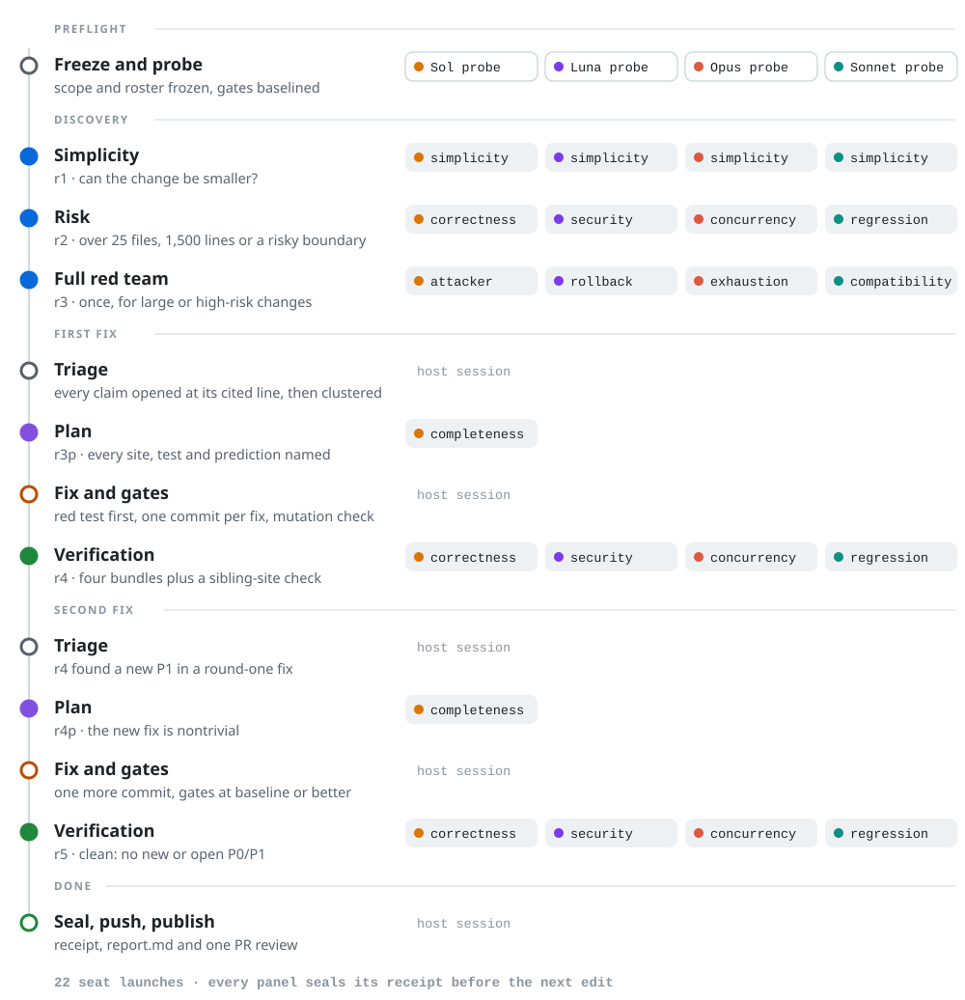

<p align="center">
  <picture>
    <source media="(prefers-color-scheme: dark)" srcset="docs/assets/hero-dark.svg">
    
  </picture>
</p>

<p align="center">
  <a href="CHANGELOG.md"></a>
  <a href="LICENSE"></a>
  
  
  
</p>

<p align="center">
  <a href="#install">Install</a> &nbsp;·&nbsp;
  <a href="#quick-start">Quick start</a> &nbsp;·&nbsp;
  <a href="#how-a-review-runs">How a review runs</a> &nbsp;·&nbsp;
  <a href="#configure">Configure</a> &nbsp;·&nbsp;
  <a href="#evidence-and-receipts">Evidence</a> &nbsp;·&nbsp;
  <a href="#status-reports-and-publication">Outputs</a> &nbsp;·&nbsp;
  <a href="#reference">Reference</a>
</p>

Review Council runs one change past independent reviewers from different labs, opens every
claim they make at its cited line, fixes what holds up, reruns your project's gates, and sends
the fixes back through review until no material risk remains. Reviewers only read. The session
you run it from owns every edit, test, commit and publication.

## Why a council

- **Different labs fail differently.** A reviewer that shares your model's weights shares its
  blind spots. OpenAI and Anthropic seats, plus Gemini when it is installed, read the same
  change independently.
- **Agreement is not proof.** Every finding is checked against source before anything changes.
  Rejected claims are recorded with their reason, so later panels do not raise them again.
- **Fixes get reviewed too.** In 11 past runs, 56% of findings were defects in an earlier
  review fix ([churn analysis](docs/churn-analysis-2026-09-06.md)). A plan gate checks each
  nontrivial fix before it is written, and a verification panel reviews the result.
- **Every result is receipted.** Source, prompt, transcript, model and effort are hash-bound.
  A review either provably ran over the named bytes or is reported incomplete.

## Install

**Claude Code**

```bash
claude plugin marketplace add WiktorStarczewski/review-council
claude plugin install review-council@review-council
```

Restart Claude Code or run `/reload-plugins`.

**Codex**

```bash
codex plugin marketplace add WiktorStarczewski/review-council
codex plugin add review-council@review-council
```

Start a new Codex chat. [Codex setup](docs/codex.md) covers branch installs, local
development and host differences.

<details>
<summary><b>One-line installers, updates and requirements</b></summary>

<br>

| | Claude Code | Codex |
| --- | --- | --- |
| one-line install | `curl -fsSL https://raw.githubusercontent.com/WiktorStarczewski/review-council/main/install.sh \| bash` | `curl -fsSL https://raw.githubusercontent.com/WiktorStarczewski/review-council/main/install-codex.sh \| bash` |
| update | `claude plugin update review-council` | `codex plugin marketplace upgrade review-council`, then `codex plugin add review-council@review-council` |
| after install or update | restart or `/reload-plugins` | new chat |

The Claude Code one-liner also enables auto-update for the added marketplace. Pass
`--no-auto-update` (`... | bash -s -- --no-auto-update`) or set
`REVIEW_COUNCIL_NO_AUTO_UPDATE=1` to leave Claude Code's third-party marketplace default
unchanged. Rerunning it updates an existing marketplace. It changes only Claude Code's
marketplace configuration: the settings file is rewritten at 2-space indent with
every other setting preserved. The rewrite is atomic, keeps the file mode, follows an
existing symlink and refuses an unparseable file; a new file is created with mode 600. The Codex one-liner
accepts `--ref <branch>` or `REVIEW_COUNCIL_REF` to install another branch.

**Requirements**

- Bash, Git, and Python 3 with only its standard library
- `gh`, for PR scopes, PR-base resolution and review publication
- ripgrep for plan-search replay: Claude Code falls back to its embedded copy, Codex needs a
  real `rg` (or `REV_RG`)
- the provider CLIs your roster needs, installed and signed in

</details>

## Quick start

| In Claude Code | What it does |
| --- | --- |
| `/review-council:rev` | reviews and fixes this branch against its base |
| `/review-council:rev uncommitted --read-only` | reports findings on your working tree, changes nothing |
| `/review-council:rev https://github.com/o/r/pull/12` | reviews a PR and posts the result to it |
| `/review-council:rev branch 4 --base origin/next` | at least four numbered panels against an explicit base |
| `/review-council:rev docs/design.md` | read-only review of a document |
| `/review-council:stack /absolute/path/to/stack-config.sh` | reviews a multi-repository change in dependency order |

In Codex, ask in plain words: *"Use review-council to review this branch against
origin/main"*, *"... for one round, read-only, on my uncommitted changes"*, or *"... to review
the SDK and wallet branches as a dependency stack"*.

> [!TIP]
> Run it from a working branch. Preflight refuses to start while `HEAD` is on `main`,
> `master`, the default branch or the base branch.

<details>
<summary><b>Every scope form</b></summary>

<br>

| Scope | Reviews |
| --- | --- |
| omitted or `branch` | the current branch against its resolved base |
| `uncommitted` | staged, unstaged and untracked work |
| a path | the selected files or directory |
| a branch name | that branch against its base |
| PR number or URL | the PR head against its declared base |
| `.md`, `.txt` or `.rst` paths | the documents, read-only, as a full-scope panel |
| `--read-only` | findings only: no fixes, commits or push |
| `--base <ref>` | an explicit base, when the printed base is wrong |
| a number | a minimum panel count on the legacy numbered schedule |

Claude Code reviews another branch or a PR by checking it out in the current checkout
(`git checkout`, `gh pr checkout`); Codex reviews it in an isolated worktree. Code reviews
use the adaptive workflow by default. Document and plan reviews run one panel unless a round
count is given. The author's PR description is left out of reviewer prompts by default,
because it measurably anchors reviewers.

</details>

## How a review runs

<picture>
  <source media="(prefers-color-scheme: dark)" srcset="docs/assets/loop-dark.svg">
  
</picture>

- **Seats only read.** Codex seats run in the read-only sandbox, Gemini in plan mode, and
  Claude CLI seats get only `Read` and `Grep`. The host session triages, edits, tests,
  commits and publishes.
- **Depth adapts to the change.** An ordinary change gets simplicity discovery and one
  verification panel, 8 seat launches. A large or risky change adds a risk panel and a red team.
- **One commit per fix.** Each finding cluster is its own commit, P0 first, and the subject
  names the finding IDs it closes, for example `fix(rev): F-012, F-019 re-check hold
  ownership`. The loop never squashes, amends or skips hooks.
- **It stops when the latest state is clean.** That means a valid four-bundle verification,
  no new or open P0/P1, nothing unreviewed, and gates at or better than baseline.
- **It stops for you when the review starts reviewing itself.** If two receipted rounds cite
  lines the review changed, the run pauses and recommends reverting those changes and
  deferring the findings that caused them (the review-origin breaker).

### Anatomy of a large review

A 60-file change that touches persistence and concurrency. Discovery finds defects that need
a nontrivial fix, and verification then finds one new P1 inside that fix:

<picture>
  <source media="(prefers-color-scheme: dark)" srcset="docs/assets/large-review-dark.svg">
  
</picture>

Every panel seals its receipt before the next edit. Had round two needed only a P3 or a
one-line P2, the project gates alone would cover it and the run would end at 17 launches.

<details>
<summary><b>Phases and when they run</b></summary>

<br>

| Phase | Runs when | Covers |
| --- | --- | --- |
| simplicity discovery | always | every core seat asks whether the change can be smaller through reuse or deletion |
| risk discovery | more than 25 files, more than 1,500 lines, or a high-risk boundary | the four risk bundles across the panel |
| full red team | once, for a large, high-risk, user-marked-important or explicitly adversarial review | four adversarial compositions over the risk bundles, with sibling-site completeness, before planning |
| plan | after triage and before any edit, when an accepted fix is nontrivial | one plan-completeness seat; `plan_seats: "all"` adds soundness, simplicity and falsifiable-test seats |
| fix and gates | after the plan passes, or a recorded plan skip | root-cause clusters, red-first regression tests, project gates at baseline or better |
| verification | after discovery when no fix follows, otherwise after the latest fixes | all four risk bundles over the latest material state, plus a sibling-site check of every fix commit |

High-risk boundaries are security, persistence, concurrency, transactions, protocols, public
APIs and irreversible mutations. The host applies these thresholds when it plans the review;
no script enforces them.

</details>

<details>
<summary><b>Seat launch budget</b></summary>

<br>

For the four-seat council:

| Change shape | Planned seat launches |
| --- | ---: |
| ordinary, no nontrivial fix | 8 |
| ordinary, with one plan panel | 9 |
| large or high-risk, no fix, current enforced combined receipt | 12 |
| large or high-risk, no fix, combined receipt ineligible | 16 |
| large or high-risk, with one plan panel | 17 |
| important or adversarial, no fix, current enforced combined receipt | 8 |
| important or adversarial, no fix, combined receipt ineligible | 12 |
| important or adversarial, with one plan panel | 13 |

These are launch counts, not measured provider cost. The red team keeps all four bundles, the
full cumulative owner, adversarial emphases and sibling-site completeness, so when no fix
follows its sealed receipt can also stand as verification. That saves one separate panel
while the receipt still covers the unchanged material state. A fix, or stale source,
instructions, roster or evidence, requires a separate verification panel. With
`plan_seats: "all"`, every plan panel launches all four core seats instead of one.

One four-bundle verification panel reviews the latest material state: the current combined
panel when no fix follows, a separate panel after simplicity-only discovery, or a fresh panel
after fixes. Before omitting a separate panel, and again immediately before completing with a
reused receipt, `rev-evidence.py current-coverage "$S"` must report it eligible: the latest
receipt must authenticate a complete enforced verification panel against current source and
instructions. Risk-only and unenforced Agent receipts never qualify.

Adaptive default panels use core seats and omit extras. Explicit numeric round plans may
include extras in their configured rounds.

Another plan and verification cycle starts only for a new P0/P1 root cause, an open P0/P1, or
another nontrivial fix. A P3 or one-line P2 follow-up needs the project gates. Every other
accepted fix needs the full adaptive verification panel.

</details>

<details>
<summary><b>Review bundles and red-team emphasis</b></summary>

<br>

Every risk and verification panel covers all four bundles:

| Bundle | Asks about |
| --- | --- |
| `correctness-boundaries` | logic, edge cases, errors, input and output boundaries |
| `security-state-api` | trust boundaries, durable state, compatibility, public contracts |
| `concurrency-resources-performance` | races, cancellation, ownership, cleanup, limits, hot paths |
| `tests-observability-maintenance-regression` | meaningful tests, failure visibility, maintainability, cumulative regressions |

With four seats each seat takes one bundle; with three, one seat takes two; surplus seats
cycle the bundles. The regression bundle owns the full cumulative state.

Every code panel also adds a red-team emphasis to one core seat, rotating through the roster
from panel to panel. The seat keeps its lens and bundle, and no provider call or panel is
added. The conditional full red-team panel reuses the four bundles with attacker and trust
boundary, rollback and recovery, duplication and exhaustion, and consumer compatibility
emphases. Document panels get no red team unless you ask for an adversarial document review.

</details>

<details>
<summary><b>Simplicity first</b></summary>

<br>

Every core seat looks for:

- an existing framework, engine or repository mechanism that replaces new machinery;
- a workaround whose stated dependency limitation no longer exists;
- a parameter every caller passes identically;
- a generic or test axis with only one implementation or value;
- an unreleased migration that can fold into the schema it changes;
- a public surface that does not follow the repository's export convention;
- scope larger than the named consumer requires.

A reuse finding must name the existing symbol, its location and version. Scope cuts stay the
author's call. On eight held-out PRs, four simplicity seats found 6 of 10 load-bearing
simplifications and one seat found about half that. Swapping in one `clean-room` seat, or
showing seats the author's PR description, lowered recall, so both are opt-in
([evaluation](docs/simplicity-lens-eval-2026-09-06.md)).

</details>

<details>
<summary><b>Plan gate</b></summary>

<br>

Accepted findings are grouped by root cause before anything is edited. Each nontrivial
cluster in `fix-plan.md` names:

- its finding IDs and severities, and the general rule that closes them;
- every affected site, branch, realm, caller, test and documentation copy;
- the behaviour that must stay unchanged, interactions and landing order;
- a falsifiable regression test and its **Prediction**, the failure the test must show
  before the fix.

Each cluster's sibling-site search is replayed once against the frozen repository, in one of
two forms:

```bash
rg --hidden --no-ignore --glob '!.git/**' --null -n -- 'PATTERN' .
grep --exclude-dir=.git --null -r -n -- 'PATTERN' .
```

The search must return 1-80 records, and every hit must be either a named site or an
`Excluded: <path> - <reason>` entry. Patterns are capped at 1024 bytes and output at 32 KiB.
Extra path operands, traversal filters, redirected output, other grep frontends, saturated
results or producer errors fail closed. Live fallback searches append `| head -81`, where the
81st record is an overflow sentinel.

The plan-completeness seat is the first surviving core seat, preferring one that is not on
the Agent adapter. It receives the full cumulative patch, every cluster and the inline plan,
which is authoritative. With `plan_seats: "all"`, each cluster also goes to one specialist,
which gets a receipt-relative fix delta when one is valid and the cumulative closure
otherwise, and must open one exact primary artifact as its first native read. A failed plan
seat gets one `<N>px` replacement panel; if that fails too, the plan stays incomplete rather
than broadening to legacy full scope.

`rev-state.sh` refuses `phase=fix` while P0-P2 findings are open until the round's plan panel
completed or `findings.md` records `Plan panel r<N>p - SKIPPED: <reason>`. It also refuses
open counts that predate the round's newest seat exit.

Whenever tests change, every prompt applies a vacuity check: name the production change that
would make each assertion fail. An assertion with no such change is reported as a P1.

</details>

<details>
<summary><b>Triage, fixes and convergence</b></summary>

<br>

Every claim is opened at its cited location and followed through the relevant control flow
before it is accepted.

| Level | Meaning | Examples |
| --- | --- | --- |
| P0 | incorrect behaviour, security hole, data loss or crash | authorization bypass, destructive state corruption |
| P1 | reachable bug, edge case or broken contract | duplicate side effect, missing retry boundary, incompatible API behaviour |
| P2 | maintainability, performance, missing test or unclear API | avoidable hot-path cost, untested failure branch |
| P3 | trivial style, naming or comment issue | stale harmless comment, naming nit |

Each finding is `OPEN`, `FIXED`, `REJECTED (reason)` or `DEFERRED (reason)`. Duplicates merge
by root cause and keep every reporting seat. Rejections carry a source-backed reason, so later
panels do not resurface them. A P3 is fixed inside a cluster only when trivial and safe; a
correct but out-of-scope finding is deferred with its reason.

The host fixes accepted findings within the authorized scope:

1. Apply one root-cause rule across every listed site, P0 first.
2. Run the cluster's predicted test red first. A different failure stops the fix.
3. Preserve unrelated user changes.
4. Run the repository's full gate list, not the subset the diff suggests, and restore
   baseline or better.
5. Run `rev-mutate.sh` over the changed hunks and compare the result with the prediction.
6. Commit each cluster on its own when commits are authorized.
7. Run a full four-bundle verification panel after a material fix.

Adaptive review completes when the latest four-bundle verification is valid, no P0/P1 is new
or open, no material change is unreviewed, project gates are at or better than baseline, and
the final receipt seals. Completion and the numeric stop gate only on P0/P1; P0-P2 gate
`phase=fix` through the plan gate.

The review-origin breaker counts, at each `phase=fix`, the selected seat findings that land
on lines changed since the first receipt's snapshot. When two receipted rounds after the last
acknowledgement have a nonzero count, the host stops, asks you, and records the answer.
Numeric, stack and legacy rounds are not counted.

An explicit round count selects the legacy schedule below. It is a minimum, not a stop:
numeric mode continues while the last numbered panel found a new P0/P1 or needed nontrivial
fixes, a P0/P1 is open, or a lens or major file is unreviewed. It stops after two consecutive
numbered code panels with no new P0/P1, none open, and gates at or better than baseline. Plan
panels do not count toward the total.

Read-only code reviews run the full setup, including preflight and baseline gates, fan out,
triage and publish the PR review, then stop: no fix, verification, commit or push.

</details>

<details>
<summary><b>Legacy numeric schedule</b></summary>

<br>

| Round | Emphasis | Lenses | Extra |
| ---: | --- | --- | --- |
| 1 | reduce the change | simplicity on every core seat | - |
| 2 | logic and boundaries | correctness, edge cases, error handling | - |
| 3 | security and state | security, data state | `codex-review` |
| 4 | concurrency and resources | concurrency, resources, performance | - |
| 5 | contracts and compatibility | API contract, readability, plus data state (Claude Code) or maintainability (Codex) | - |
| 6 | verification | tests, observability | - |
| 7 | adversarial challenge | red team | - |
| 8 | cumulative reread | regression | - |
| 9+ | remaining gaps | uncovered or unresolved lenses | - |

</details>

## Configure

Out of the box, with no config file, the roster is built from whatever is installed and
signed in:

| Seat | Model | Effort | Seated when |
| --- | --- | --- | --- |
| `codex-sol` | newest Sol | `xhigh` | Codex CLI signed in |
| `codex-luna` | newest Luna | `xhigh` | Codex CLI signed in |
| `opus` | Opus | `xhigh` | Claude CLI signed in, or Claude Code Agent seats |
| `gemini` | `gemini-2.5-pro` | default | Gemini CLI installed and signed in |

Sol and Luna resolve once per run and freeze to exact slugs before probing. The
`codex-review` extra is also available to explicit numeric schedules.

**The four-seat council.** For two OpenAI and two Anthropic seats and a run that refuses to
start without them, create `~/.config/review-council/config.json`:

```json
{
  "exclude": ["gemini"],
  "codex_models": ["latest-sol", "latest-luna"],
  "codex_effort": "xhigh",
  "claude_models": ["opus", "sonnet"],
  "extras": false,
  "min_labs": 2,
  "quota_fallback": true
}
```

- The newest visible Sol and Luna must support `xhigh` and pass their probes.
- Opus and Sonnet must both pass their probes, and every seat runs at `xhigh`.
- Gemini and the `codex-review` extra are left out.
- At least two provider labs must be available before ordinary execution.
- A quota or capacity failure may temporarily swap in a substitute seat, visibly.

> [!NOTE]
> Without `codex_models` in the config, a Sol or Luna that cannot be resolved drops the
> Codex lab and the panel is padded and marked degraded. With it, the run stops and names the
> missing family.

<details>
<summary><b>Every config key</b></summary>

<br>

| Key | Default | Purpose |
| --- | --- | --- |
| `exclude` | `[]` | drop detected labs or seats, e.g. `["gemini"]` |
| `pin` | `{}` | override a detected seat's model or effort |
| `codex_models` | `latest-sol`, `latest-luna` | require one or two exact slugs or `latest-<family>` selectors |
| `codex_effort` | `xhigh` | require one effort (`max`, `xhigh` or `high`) on every OpenAI seat |
| `claude_models` | absent | require exact `opus` and/or `sonnet` seats |
| `claude_seats` | `1` | legacy count of Opus seats; mutually exclusive with `claude_models` |
| `claude_seat` | `true` | `false` disables detected Claude seats |
| `claude_adapter` | `auto` | Claude Code runs Anthropic seats on the CLI (`cli`), as Agent subagents (`agent`), or on the CLI when signed in (`auto`) |
| `plan_seats` | `completeness` | one plan-completeness seat per plan panel, or `all` for the four-lens plan panel |
| `extras` | `true` | expose `codex-review` to explicit numeric schedules |
| `min_labs` | `1` | minimum detected provider labs before padding |
| `quota_fallback` | `false` | allow temporary cross-provider quota substitution |
| `check_updates` | `false` | print an available-update line in Claude Code |

The path is `${REVIEW_COUNCIL_CONFIG:-$HOME/.config/review-council/config.json}`. An
environment variable overrides its config key where one exists. Every key and its exit codes:
[docs/config.md](docs/config.md).

</details>

<details>
<summary><b>Environment variables</b></summary>

<br>

| Variable | Default | Purpose |
| --- | --- | --- |
| `REV_BASE_REF` | unset | the environment form of `--base` |
| `REV_PATCH_CHUNKS` | `auto` | automatic, forced (`1`) or disabled (`0`) exact patch chunks |
| `REV_SOURCE_CONTEXT` | `1` in the skills, `0` in the script | literal source packets and required-source segments; `0` is for labeled baseline measurement |
| `REV_UNENFORCED_AUDIT` | unset | `1` runs, and caches, the advisory read audit of Agent seats |
| `REV_PLAN_SEARCH_TIMEOUT` | `30` | seconds shared by all plan sibling-site searches, at most 300 |
| `REV_RG` | `rg` on PATH | the ripgrep that replays plan searches |
| `REV_CODEX_SOURCE_BATCH` | `0` | certified Codex-only source-window batch canary |
| `REVIEW_COUNCIL_CLAUDE_ADAPTER` | unset | the environment form of `claude_adapter` |
| `REVIEW_COUNCIL_CLAUDE_SEAT` | unset | `0` disables detected Claude seats |
| `REVIEW_COUNCIL_CODEX_MODELS_CACHE` | shared cache | pin a Codex catalog and skip its version check |
| `REVIEW_COUNCIL_GEMINI_MODEL` | `gemini-2.5-pro` | the Gemini seat's model |
| `REVIEW_COUNCIL_LOGIN_TIMEOUT` | 20 s | bound on each sign-in check |
| `REVIEW_COUNCIL_PROBE_TIMEOUT` | 60 s | bound on each live probe |
| `REVIEW_COUNCIL_CODEX_VERSION_TIMEOUT` | 5 s | bound on `codex --version` for the catalog check |
| `REVIEW_COUNCIL_CATALOG_REFRESH_TIMEOUT` | 30 s | bound on one `codex debug models` refresh |
| `REVIEW_COUNCIL_PROVIDER_OUTPUT_BYTES` | 1 MiB | provider status and probe output cap |

Installer, update-check and contract-check variables are in [docs/config.md](docs/config.md).

</details>

<details>
<summary><b>Roster, probing and padding</b></summary>

<br>

The roster is data, not an assumption. `roster.json` records each seat's stable name, lab
and adapter, exact model and effort, and whether it is core, extra or padded, along with
exclusions and their reasons, active degradation, strict refusal class, temporary quota
substitutions (`substitutes_for`), and the result-receipt policy.

Detection is cheap: binary, sign-in state, credentials and the local model cache. Preflight
then makes a bounded live probe of each unique adapter, model and effort. Agent-adapter seats
are not probed. `latest-sol` and `latest-luna` follow the `codex` binary that launches seats:
the shared `models_cache.json` counts only when its `client_version` matches
`codex --version`. A mismatch is refreshed once with `codex debug models`, or the run exits 5
and names both versions.

Without an exact setting, a short roster is padded to three seats and marked degraded. Padded
seats get different lenses but never count as another lab, and `min_labs` turns lab diversity
into a hard floor. Exact model and seat counts are checked before padding. Claude Code pads
with Opus on the resolved Claude adapter. Codex pads only from surviving external CLI seats,
and refuses when none remain.

</details>

<details>
<summary><b>Quota fallback</b></summary>

<br>

Off by default; enable it with `{ "quota_fallback": true }`.

| Blocked provider | Temporary substitute |
| --- | --- |
| Anthropic quota or capacity | a uniquely named seat of the selected Luna (or of Terra, when Terra is seated) |
| OpenAI quota or capacity | a uniquely named Sonnet seat, when a probed Sonnet CLI seat is in the roster |

- Only provider-reported quota or capacity qualifies. A Claude Code Agent seat uses platform
  terminal metadata, never reviewer prose. Authentication, configuration, unknown,
  missing-target and failed-target errors never substitute.
- Each substitute records `substitutes_for`. A temporary `min_labs` waiver applies only when
  the substitutions cover the whole diversity shortfall.
- The fallback runs in a fresh sibling session whose scope, file lists and evidence manifest
  must match the original exactly, and it inherits the review-origin window. Results from
  the quota-failed label stay diagnostic.
- One fallback panel is the only full-panel restart allowed, and a substitute that also hits
  quota stops the panel. Fallback never edits configuration, and the next review probes the
  preferred roster again.

</details>

<details>
<summary><b>Claude Code and Codex differences</b></summary>

<br>

| Behaviour | Claude Code | Codex |
| --- | --- | --- |
| Anthropic seats | signed-in Claude CLI, else built-in Agent seats (`claude_adapter`) | signed-in Claude CLI |
| OpenAI seats | Codex CLI | Codex CLI |
| thin roster padding | Opus on the resolved Claude adapter | surviving external CLI seats |
| no usable external CLI | a visibly degraded Agent panel | refuses |
| another branch or a PR | checked out in the current checkout | reviewed in an isolated worktree |
| session startup policy | plugin hook | native skill discovery |
| stop guard while a review is open | `Stop` hook | none |
| stack leg | `claude -p` | `codex exec` |
| stack finishing default | push and publish, unsquashed | local and unsquashed |

Both hosts share the roster, evidence compiler, schema, adapters, ledgers, status, profiling
and receipts.

</details>

## Evidence and receipts

A plausible answer is not a review. A seat's result counts only when it is bound to the
frozen source, proves it read every byte of the change it was assigned, cites only ranges it
actually read, and validates against the shared schema. A panel counts only when one valid
result covers every assignment. A run missing any audit, receipt or final report its mode
requires is incomplete and cannot be described as a Review Council review.

> [!IMPORTANT]
> A receipt proves the review contract ran over the named bytes. It does not make a finding
> true. Triage still checks every claim against source.

<details>
<summary><b>Preflight and frozen scope</b></summary>

<br>

Preflight runs before any paid call. It resolves the repository root, base, head and changed
paths; refuses when a review is already active, the directory is not a Git repository, or
`HEAD` is on a shared branch; writes `scope.env`, `files.txt`, `untracked.txt` and
`roster.json`; probes the roster; and, when self-host boundaries changed, replays preserved
provider envelopes against the current adapters and auditors. The host then writes the
baseline patch and records existing gate failures before any fix.

The base resolves from, in order: `--base`, `$REV_BASE_REF`, the open PR's declared base, the
nearest fork point among the default branch, `next`, `develop`, `dev` and `release` (ties go
to the default), then `origin/HEAD`, else a local `main` or `master`.

Every later artifact binds the frozen source identity, so a changed snapshot cannot combine
with earlier prompts, results, audits or receipts. A session directory is fresh, initialized
or invalid; an initialized session resumes without rerunning preflight or the probe.

</details>

<details>
<summary><b>Evidence compiler</b></summary>

<br>

Adaptive code and plan panels do not paste the repository into every prompt.
`rev-evidence.py` builds a deterministic, auditable evidence packet from the frozen scope.

**Routing.** Changed code is grouped into dependency components. Every component gets a
specialist plus the full-state integration seat, and a component with a prior finding
returns to that finding's seat when safe. Lockfiles, generated output, snapshots and locale
copies go to the named full-state seat only. If complete coverage cannot be proved, the panel
falls back to the full cumulative patch.

**Patch proof.**

| Delivery | Used when | Limits |
| --- | --- | --- |
| bounded windows | the patch is empty, has NUL bytes or invalid UTF-8, chunks are disabled or unrepresentable, or chunks save under 10% of reads | 240 lines per window |
| ordered chunks | a safe UTF-8 patch where chunks save at least 10% of reads, or capacity requires them | 24 KiB raw, 30 KiB rendered and 1,000 displayed lines per chunk |

Chunk byte ranges are contiguous and reconstruct the canonical patch exactly. Reading chunks
out of order fails the audit; reading them after source packets, or twice, is an advisory.
Chunk reads prove change coverage, not a finding's citation. `REV_PATCH_CHUNKS=auto` is the
default, `1` forces representable chunks, and `0` requests windows and fails preparation when
they cannot fit.

**Source packets** hold exact bytes from the frozen tree: enclosing declarations, direct
callers and changed local imports, related tests, configuration gates, and repository
instructions in a separate bound snapshot. Shards are capped at 16 KiB. A specialist gets one;
the integration seat and every plan seat get up to three. Oversized ranges become ordered,
gap-free session artifacts of at most 240 lines and normally 16 KiB, and an indivisible line
may use the 32 KiB tool-output ceiling.

**Capacity compilation.** Before a prompt is published, every read obligation (chunks or
windows, source shards and segments, the evidence index and repository expansion, a plan
specialist's mandatory first read, and reserved room for investigation and the findings JSON)
is checked against the adapter's call and turn capacity. Excess ranges become session
artifacts, and chunks switch on when windows cannot fit. If the read contract still cannot
fit, preparation fails before any launch. Prompts above 1,800 words (code) or 3,000 words
(plans) warn instead of silently truncating evidence.

</details>

<details>
<summary><b>Reviewer read contract</b></summary>

<br>

Each prompt names the only authorized artifacts and their order. The audit requires the
exact manifest and prompt hashes, a supported provider transcript, at least one recognized
review tool call, complete assigned patch, source-packet and required-source reads in chunk
order, the plan specialist's mandatory first read, repository expansion inside scope, every
finding citation inside an audited source range, and valid findings JSON.

Claude CLI seats get only `Read` and `Grep`, behind bounded pre-tool and post-tool checks;
inherited settings, plugins, MCP configuration and editing tools are disabled. Claude adapters
may take two ordered proof reads per turn under a 60 KiB combined cap; other adapters take
one. Repository expansion is capped at 16 calls, 4 of them reserved for refutation. Nonfinal
Claude CLI responses carry a continuation instruction, so progress text alone cannot end the
task after compaction.

Agent-adapter seats (`claude_adapter: agent`, or `auto` without a signed-in Claude CLI)
disable editing tools, but their native read hooks cannot satisfy enforced evidence. They
still run evidence mode and are listed in the manifest's `unenforced_seats`, so a panel
holding one is partially unenforced and never certified. Their advisory read audit runs only
with `REV_UNENFORCED_AUDIT=1`; otherwise each row records `would_pass: false` with the reason
`advisory read audit is off`.

</details>

<details>
<summary><b>Result validation and seat recovery</b></summary>

<br>

A result is complete only after:

1. the provider process terminates;
2. a terminal `.exit` receipt is written;
3. the findings JSON validates against `findings.schema.json`;
4. it matches an immutable prompt generation;
5. its read audit is valid, for evidence panels;
6. a panel receipt selects exactly one valid generation per assignment.

Unsupported stream shapes, zero-tool answers, missing output, malformed JSON, stale receipts,
hash mismatches and incomplete evidence reads cannot certify a panel. When patch,
required-source, citation and result proof are complete, read order, repository call count,
output overflow, a missing navigation index and duplicate reads stay visible as advisories
without discarding the review. One seat generation gets at most four provider calls across
wrapper and host retries, including the wrapper's own zero-tool retry; exhausting them is a
local exit 7, never quota.

| Failure | Recovery |
| --- | --- |
| first provider exit 1 or 2, with no invalid audit | retry only that seat, once, with the exact prompt, assignment, model and effort |
| hard read-audit failure | keep every artifact, never relaunch under that label, and replace the assignment once on another enforced seat (`<N>x`, or a one-seat `<N>px` plan panel) |
| a seat or plan seat fails twice | replace the assignment once on another enforced seat |
| no eligible seat, a second failure in the panel, or a failed replacement | leave the panel incomplete and ask the user |
| receipt failure | diagnose the provenance or contract defect and end the run |

A hard audit failure ends only that seat's assignment: valid siblings keep running and keep
their results, transcripts, audits and usage. A replacement has full scope, and fixes wait
until the receipt seals.

</details>

<details>
<summary><b>Exit codes and fail-closed conditions</b></summary>

<br>

| Exit | Class | Meaning | Action |
| ---: | --- | --- | --- |
| 0 | success | valid findings result | audit and retain |
| 1 | seat-local | retryable provider or adapter failure | exact retry once when no invalid audit exists |
| 2 | seat-local | missing or invalid findings JSON, a hard audit failure, or a refused relaunch under a failed label | retry once only for invalid JSON with no invalid audit; otherwise replace |
| 3 | provider-global | not signed in | stop and name the required sign-in |
| 4 | provider-global | quota, rate or capacity | stop, or use explicit quota fallback |
| 5 | roster availability | possible roster not currently available | keep the session and retry when availability changes |
| 6 | roster configuration | malformed or impossible exact configuration | fix the configuration first |
| 7 | local attempt budget | the seat generation used all four calls | keep valid siblings; never treated as quota |

The run also fails closed when the source changed after freeze; on a prompt, manifest,
transcript or result hash mismatch; on incomplete patch, packet, segment, search or citation
proof; on a provider stream shape the auditor does not support; when a plan task exceeds
compiled capacity; when a project gate falls below baseline; and when a stack leg exits
without a fresh `stack-report.md` and `phase=stack-ready`.

</details>

<details>
<summary><b>Security boundaries</b></summary>

<br>

- Codex seats run in the read-only sandbox and Gemini seats in plan mode. Claude CLI seats
  get only audited `Read` and `Grep`, with editing tools disallowed and no inherited plugins,
  settings or MCP configuration.
- Prompts cannot grant editing, execution, publication or credential access.
- Evidence search accepts one documented repository-root form and treats pattern and paths as
  data.
- Prompt, output, provider-status and provider-version calls are bounded in time and output,
  and raw provider streams are kept before any retry.
- Session evidence lives outside the reviewed source. Verifier state and material reads are
  descriptor-relative, reject symlink traversal, and recheck source identity around use.
- Local plugin publication installs atomically, so a failed replacement keeps the live plugin.
- `REV_ACTIVE=1` blocks nested reviews, and `REV_STACK_LEG=1` blocks nested stacks.
- Reviewers never execute findings. The host verifies each claim before changing code.

</details>

## Status, reports and publication

While a run is active, `rev-status.sh` prints one line every ten minutes, read from session
files without contacting a provider:

```text
r3/adaptive triage | sol: done 4f 9m | codex-luna: running 14m ← rg "retry" src/api | opus: done 3f 8m | sonnet: done 2f 7m | open P0:0 P1:1 P2:3 fixed 6
```

Each seat is `pending`, `running` with its last action, `done` with finding count and time,
`failed exit=<code>`, or `dropped`. The line is capped at 220 characters and ends with
`+N seats` when seats are cut. `rev-context.py` gives a compact briefing for a resumed
session, and a local watch that emits at start, on each change and at ten-minute ticks.

<details>
<summary><b>Session artifacts and receipts</b></summary>

<br>

A session lives outside the reviewed tree, normally at `/tmp/rev-<epoch>`; stack legs live
under `/tmp/review-council-stack-<epoch>/<label>`.

| Kind | Files |
| --- | --- |
| scope and roster | `scope.env`, `files.txt`, `untracked.txt`, `roster.json`, `00-baseline.patch`, `baseline.md`, optional `baseline.json`, `docs.txt` for document reviews |
| ledger and state | `findings.md`, `rejected.md`, `fix-plan.md`, `context.md`, `state.json`, `coverage-head.json` |
| per panel | `r<label>-evidence.manifest.json`, evidence packets and patches, `r<label>-panel.tsv`, `r<label>-coverage.receipt.json` |
| per seat | `.prompt.md`, `.stream.ndjson`, `.log`, `.json`, `.exit`, `.read-audit.json`, and `.audit-invalid.json` only after a hard audit failure |
| attempts and contracts | `attempts/<sha>.json`, `contract-pass-<sha>.json` |
| publication and outcome | `pr-review.json`, `pr-review.md`, `pr-review-target.json`, `stack-report.md`, `report.md`, `incomplete.md` |

| Receipt | Proves |
| --- | --- |
| provider contract | the current adapter and auditor accept preserved provider envelopes for the exact provider boundary and CLI versions |
| exit | that seat generation terminated successfully |
| read audit | the transcript met its hash-bound evidence obligations |
| panel | one immutable valid generation covers every assignment |
| `stack-report.md` | a stack leg completed locally and is ready to finish and publish |
| `report.md` | publication succeeded or cleanly skipped, and the review completed |

Current-session completion and finding yield require a schema-valid result with a successful
exit receipt. Only exact hashed receiptless results recorded in a versioned legacy roster
policy may omit one.

</details>

<details>
<summary><b>Completion report</b></summary>

<br>

`report.md` leads with the outcome and current soundness, then the exact roster, efforts,
padding, substitutions and degradation; accepted, fixed, rejected and deferred findings by
severity; panel, lens and changed-file coverage; one line per fix commit and the push status;
and the residual risk that still deserves human attention. Codex reports also list baseline
and final gates. Late P0s are stated plainly, and a degraded verdict opens with its exact
reason.

On Codex, an interrupted or blocked run writes `incomplete.md` instead. On Claude Code,
`incomplete.md` records a failed publication together with the command that retries it.

</details>

<details>
<summary><b>PR review publication</b></summary>

<br>

A completed review of a branch with an open PR posts one deterministic review: a badge,
verdict tip, counts, decisions, fixes, verified-sound, coverage and footer sections. The
inspected body, open PR, merge base, observed base tip and clean reviewed head are frozen for
exact retries. Publication rebinds that state to the reviewed scope, accepts base-tip
movement only while the merge base is unchanged, and serializes local retries. It creates a
pending review pinned to the reviewed commit and submits it as `COMMENT`. Only an identical
review on that commit suppresses a duplicate.

Discovery stays within the checkout's GitHub remotes. Local branches and document reviews
without an open PR do not post, and `NO_PUSH=1` renders the review without any GitHub call.
Rendering refuses a session directory inside the reviewed repository or a dirty tree, and an
unrelated pending review by the same GitHub user blocks posting. A stack publishes only the
latest completed session per repository. Format and failure modes:
[pr-review.md](plugins/review-council/docs/pr-review.md).

</details>

<details>
<summary><b>Profiling and cost benchmarks</b></summary>

<br>

```bash
python3 plugins/review-council/scripts/rev-profile.py /tmp/rev-SESSION
```

The profile separates completed, metered and unmetered calls; provider input, uncached
input, output, reasoning and cache categories; known and unknown provider cost; prompt words
and full, assigned, delta, evidence and avoided scope words; patch-proof calls, turns, bytes
and delivery modes; plan routing; finding yield from receipt-valid results; and the core
roster signature. Mixed rosters are marked as a measurement boundary, and planned savings
stay separate from actual usage. Pass `--host-log` paths to measure host envelopes. See
[cost accounting](docs/cost-accounting.md).

[Reusable benchmarks](eval/COST_BENCHMARKS.md) compare frozen plugin versions with
provider-free checks and a bounded reviewer lane, freezing the resolved model and its rate
card.

| Study | Result |
| --- | --- |
| [wave 1](docs/cost-benchmark-wave1-2026-09-29.md) | 6.8% fewer estimated credits and 14.7% less provider time over 4 live runs, both finding 4/4 defects |
| [wave 2](docs/cost-benchmark-wave2-2026-09-30.md) | compact startup: 12.0% fewer credits and 14.4% less time on two canaries, recall 4/4; shipped |
| [wave 3](docs/cost-benchmark-wave3-2026-09-30.md) | lean packets plus decision digests: 1.0% more credits and 25.4% more time; discarded |
| [wave 4](docs/cost-benchmark-wave4-2026-09-30.md) | packet-only: 24.6% fewer credits but lower quality scores; discarded |
| [screening](docs/cost-benchmark-screening-2026-09-30.md) | every later candidate failed the fixed quality gates |

</details>

## Stack reviews

When one change spans dependent repositories, `/review-council:stack <config>` runs a review
leg per repository in dependency order, optionally reviews the seam between them, and
publishes per repository. Start from [the config template](plugins/review-council/scripts/stack.example.sh).

<details>
<summary><b>How the stack runner works</b></summary>

<br>

1. It detaches by default (`REV_STACK_FOREGROUND=1` keeps it attached) and logs to
   `/tmp/review-council-stack.log`.
2. Each repository runs as an isolated leg, `PASSES` times (default 2), in dependency order,
   from the paths or worktrees the config names.
3. One session root keeps per-leg ledgers, logs and stack-ready reports.
4. Stalls are detected from both log activity and process-tree CPU before a retry
   (`STALL_SECS=1800`, `MAX_ATTEMPTS=4`), and a retried leg resumes its own session instead
   of discarding verified work.
5. When `SEAM_REPO` is set, a two-round seam leg reviews the cross-repository boundary.
6. An optional completeness critic runs last.
7. `stack-report.md` becomes `report.md` only after publication or a no-push skip.
8. Successful repositories publish even when a sibling fails; the run then ends
   `COMPLETE WITH FAILURES` with exit 1. A failed repository is skipped entirely.

Claude Code legs run `claude -p`; Codex legs run `codex exec` with workspace-write for
authorized fixes, network access for reviewers and write access to the session root. Legs
never launch another stack. Claude Code defaults to `NO_PUSH=0` and pushes and publishes;
Codex defaults to `NO_PUSH=1`. Both default to `NO_SQUASH=1`, so review commits stay one per
fix on both hosts. A real push needs an upstream of the same branch name, or it fails
closed.

</details>

## Reference

<details>
<summary><b>Claude Code hooks</b></summary>

<br>

The Claude Code plugin installs two hooks; Codex uses native skills and installs neither.

**Session hook.** On `startup`, `clear` and `compact` it injects the standing review policy
and the detected roster summary as session context, and, with `check_updates: true`, reports
an available update. It makes no model call, and the update check is cached for a day,
bounded to three seconds, silent on failure, and never replaces the plugin.

**Stop hook.** A review is a queue, and the recurring failure is ending a turn on a status
summary while items remain. The hook blocks a stop while the newest unfinished review
session in the current working tree is open, naming its round, phase and open findings. It
allows the stop when the session is `done`, `stack-ready` or `blocked`, has a `report.md`,
`stack-report.md` or `incomplete.md`, or is genuinely waiting on seats with every returned
seat triaged and the tree clean.

It errs toward allowing: no session, a `state.json` untouched for six hours, unreadable
state, a missing `python3` or an unpersistable counter all allow, and three consecutive
blocks release the session until its review is done. Sessions match the stopping tree by
their recorded `REV_ROOT` and must be owned by the current user, and only `/tmp/rev-*`
sessions are found, so stack legs and custom session directories are not guarded. The
counter lives in `$XDG_STATE_HOME/review-council` (or `~/.local/state/review-council`), one
file per stopping session; `REVIEW_COUNCIL_STATE_DIR` and `REVIEW_COUNCIL_SESSION_ROOTS`
override the paths for tests.

</details>

<details>
<summary><b>Limitations</b></summary>

<br>

- Provider probes and reviewer calls consume each provider's usage, and a full
  multi-repository stack can consume a lot of it.
- Exact rosters depend on installed, signed-in CLIs and a Codex model cache that matches the
  `codex` binary.
- Quota fallback covers quota and capacity only. It never hides authentication,
  configuration, model, adapter or unknown failures, and an OpenAI outage can only fall back
  to a probed Sonnet CLI seat.
- A panel with an Agent-adapter seat is never certified, because that adapter cannot provide
  an enforced read transcript.
- Explicit numeric code reviews and document reviews keep full scope instead of adaptive
  evidence narrowing.
- Chunk reads prove the whole change was read; they do not replace source reads for a
  finding.
- A PR whose head branch lives on a fork is not found by publication, which skips it as if
  there were no PR. Post the rendered `pr-review.md` by hand.
- The Gemini adapter is fixture-tested against the documented streaming interface but has
  not been certified on a live Gemini CLI.
- Some sandboxes restrict nested provider CLIs or repository gates. The failure stays visible
  and never widens permissions.
- Provider-specific inline evidence beyond the current audited packets waits on a clean
  held-out council run.

</details>

<details>
<summary><b>Development and release</b></summary>

<br>

```bash
plugins/review-council/tests/run-tests.sh roster      # name-filtered shell tests
plugins/review-council/tests/run-tests.sh             # full shell suite
python3 -m unittest discover -s tests -v              # Python suite
python3 scripts/verify-review-council.py --root .     # unified release gate
```

The release gate freezes one tree, reconciles the exact test inventory, runs the shell and
Python suites, `claude plugin validate --strict` and the Codex marketplace check, and
publishes a hash-bound receipt only when every stage refers to the same source tree. It needs
the `claude` CLI, defaults to `--timeout 1800` and four workers, and reuses its receipt for an
unchanged tree. Tests use local CLI shims and never contact live provider accounts.

Build and install a local Codex bundle (the output directory must be named
`review-council`):

```bash
python3 scripts/build-codex-plugin.py --output /tmp/review-council
python3 scripts/install-codex-plugin.py
```

Installation refuses an unrelated output directory or a conflicting personal marketplace
entry, and replaces the bundle atomically. Each release is reviewed by the previous signed
release against the candidate; [the release procedure](docs/release.md) has the steps.

</details>

## License

[MIT](LICENSE)
